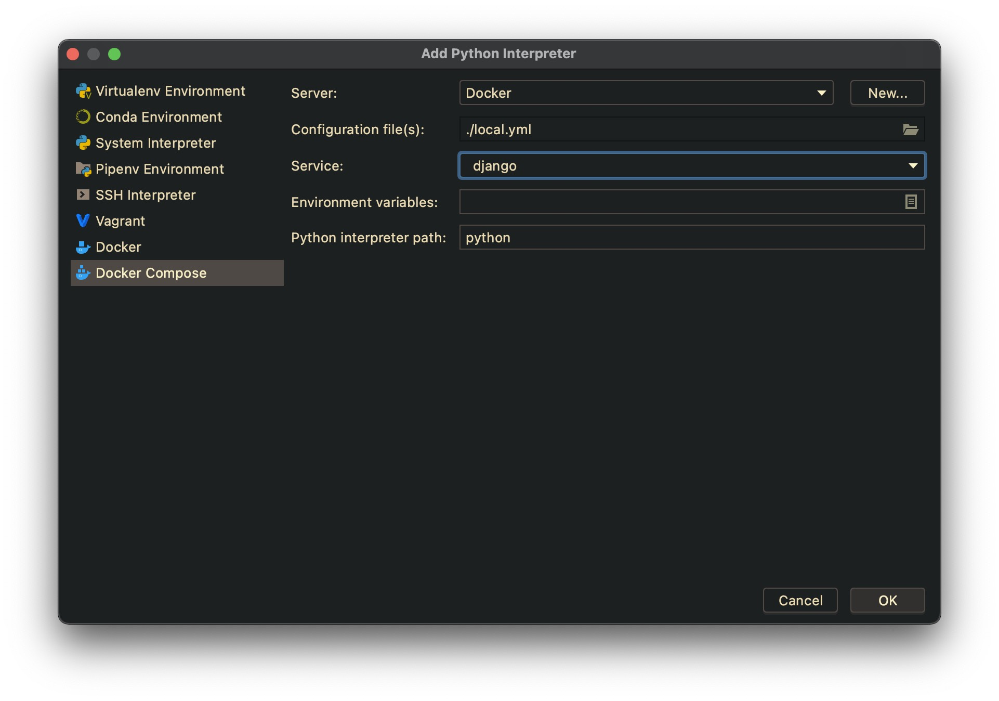
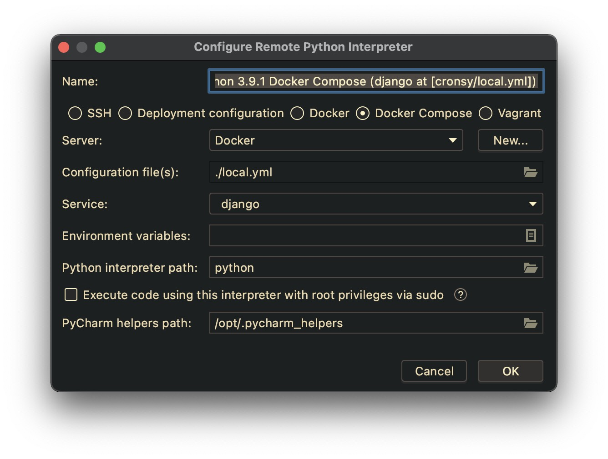
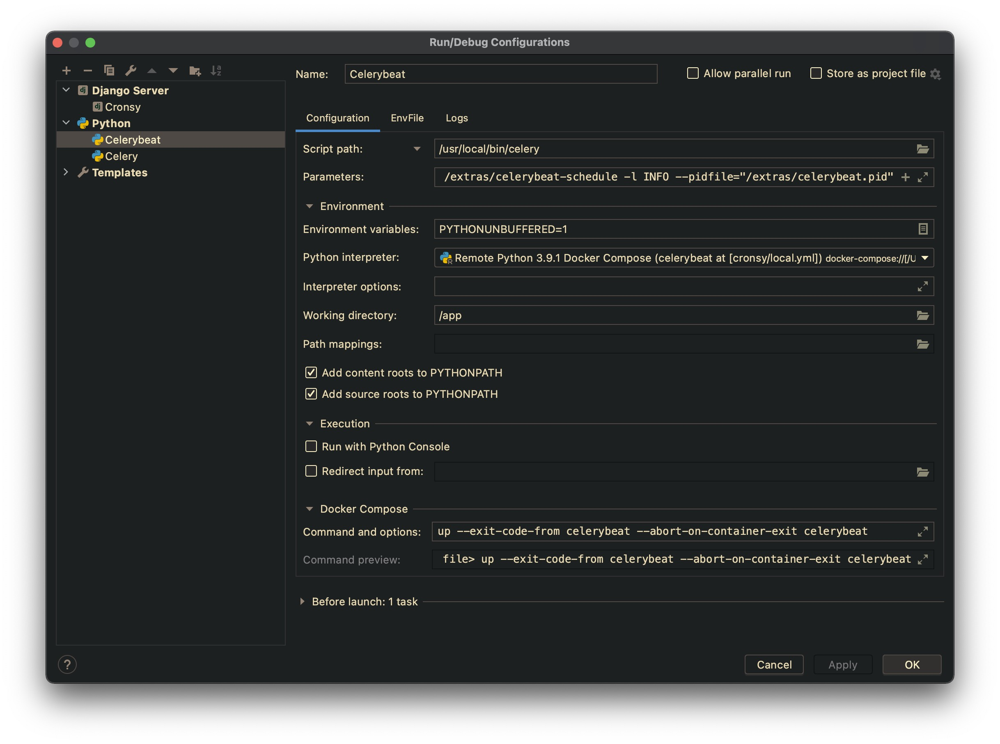

# Django Rest Docker Boilerplate by PLANEKS

📌 Insert here the project description. Also, change the caption of
the README.md file with name of the project.

## How to create the project

📌 Delete this section after creating new project.

Download the last version of the boiler plate from the repository: https://github.com/planeks/django-docker-boilerplate

You can download the ZIP archive and unpack it to the directory, or clone the repository (but do not forget to clean the Git history in that case). 

Use the global find and replace for changing the string `NEWPROJECTNAME` in the files in the `src` directory to the proper project name. The easiest way to do it just use `Replace` feature in the IDE.

There are three files where the changes should be done:

```
src/config/settings.py
src/config/templates/index.html
src/config/urls.py
```

## 🐳 Install Docker and Docker Compose

For the local computer we recommend using Docker Desktop. 
You can download it from the official site: https://www.docker.com/products/docker-desktop

There are versions for Windows, Linux and Mac OS.

For the server installation you need the Docker Engine and Docker Compose. 
Use the following commands to install Docker on Ubuntu Linux:

```shell
# Add Docker's official GPG key:
$ sudo apt-get update
$ sudo apt-get install ca-certificates curl
$ sudo install -m 0755 -d /etc/apt/keyrings
$ sudo curl -fsSL https://download.docker.com/linux/ubuntu/gpg -o /etc/apt/keyrings/docker.asc
$ sudo chmod a+r /etc/apt/keyrings/docker.asc

# Add the repository to Apt sources:
$ echo \
  "deb [arch=$(dpkg --print-architecture) signed-by=/etc/apt/keyrings/docker.asc] https://download.docker.com/linux/ubuntu \
  $(. /etc/os-release && echo "$VERSION_CODENAME") stable" | \
  sudo tee /etc/apt/sources.list.d/docker.list > /dev/null
$ sudo apt-get update
$ sudo apt-get install docker-ce docker-ce-cli containerd.io docker-buildx-plugin docker-compose-plugin
```

> If you are using another Linux distribution, please, check the official documentation: https://docs.docker.com/engine/install/

Test if Docker is installed correctly:

```shell
$ sudo systemctl status docker
```

Add the current user to the `docker` group (to avoid using `sudo`):

```shell
$ sudo usermod -aG docker ${USER}
```

## 🔨Setup the project locally

You need to run the project locally during the development. First of all, copy the `dev.env` file to the `.env` file in the same directory.

```shell
$ cp dev.env .env
```

Open the `.env` file in your editor and specify the settings:

```shell
PYTHONENCODING=utf8
COMPOSE_IMAGES_PREFIX=newprojectname
DEBUG=1
CONFIGURATION=dev
DJANGO_LOG_LEVEL=INFO
SECRET_KEY="<secret_key>"
POSTGRES_HOST=postgres
POSTGRES_PORT=5432
POSTGRES_DB=db
POSTGRES_USER=dbuser
POSTGRES_PASSWORD=dbpassword
REDIS_URL=redis://redis:6379/0
SITE_URL=http://myproject.local:8000
EMAIL_HOST=mailhog
EMAIL_PORT=1025
```

Please, use the value for `COMPOSE_IMAGES_PREFIX` that correlates with the project name. It will be used as the container images prefix for `docker-compose`.

📌 Generate the secret key for the project and paste it to the `.env` file.
Also, generate the reasonably good password for the database user.

We strongly recommend creating some local domain in your `/etc/hosts` file to work with the project :

```
127.0.0.1   myproject.local
```

We specify the following volume in the application container:

- `/data` -> `data/dev`

> If you use Linux and Docker Engine for the local development you need to
> setup proper permissions for the volume. It is important if you want to
> use Docker without `sudo`. Check the `init_production_volumes.sh` script
> and the "Deploying the project to the server" section for more details,
> and adapt it for your needs.

You need to edit `Dockerfile`, `entrypoint` and `docker-compose.dev.yml` files if you need to add other directories to the container and define them as volumes.

Use the following command to build the containers:

```shell
$ docker compose -f docker-compose.dev.yml build
```

Use the next command to run the project in detached mode:

```shell
$ docker compose -f docker-compose.dev.yml up -d
```

Use the following command to run `bash` inside the container if you want to run a management command like Django interactive shell.

```shell
$ docker compose -f docker-compose.dev.yml exec django bash
```

Or, you can run the temporary container:

```shell
$ docker compose -f docker-compose.dev.yml run --rm django bash
```

## 🏃‍ Running the project in PyCharm

> The Docker integration features are available only in the Professional version
of PyCharm.

Go to `Preferences` -> `Project` -> `Python Interpreter`. Click the gear icon
and select the `Add...` item.

Select `Docker Compose` and specify your configuration file (`local.yml`) and
the particular service.



> If the corresponding windows are differ on your version of PyCharm, and
> you have troubles with configuring the remote interpreter, you can configure
> classic UI in the registry. Go to `Help` -> `Find Action...` and type `Registry`.
> Find the `python.use.targets.api` option and disable it. Restart PyCharm.

You can also change the interpreter name for better readability later.



You need to specify remote interpreters for each of the containers you are working
with Python. For example, if you have three containers, like `django`, `celeryworker`
and `celerybeat`, you need to setup three remote interpreters.

Now you can go to `Run/Edit Configurations...` and add the particular running configurations.

You can use the standard `Django Server` configuration to run `runserver`
Specify the proper Python Interpreter and set `Host` option to `0.0.0.0`.
It is necessary, because the application server is running inside the container.


You can use `Python` configuration template to run Celery. Do not forget to
set the proper remote interpreter and working directory. Also, set the following options:

- `Script path` : `/usr/local/bin/watchgod`
- `Parameters` : `celery.__main__.main --args -A config worker --loglevel=info -P solo`

Here we use `watchgod` utility to automatically restart Celery if
the source code has been changed.


Also, create the similar configuration for Celery Beat. Use the following options:

- `Script path` : `/usr/local/bin/celery`
- `Parameters` : `-A config beat -l INFO`

Make sure you specify the proper path for `celerybeat.pid` with proper
access rights.



> Configuring runners for the PyCharm is optional but simplify using
> debugger. Anyway you can just use `docker compose -f docker-compose.dev.yml up -d`
> in the terminal.

## 🖥️ Deploying the project to the server

📌 Modify this section according to the project needs.

### Configure main user

We strongly recommend deploying the project with an unprivileged user instead of `root`.

> The next paragraph describes how to create new unprivileged users to the system. If you use AWS EC2 for example, it is possible that you already have such kind of user in your system by default. It can be named `ubuntu`. If such a user already exists you do not need to create another one.

You can create the user (for example `webprod`) with the following command:

```shell
$ adduser webprod
```

You will be asked for the password for the user. You can use [https://www.random.org/passwords/](https://www.random.org/passwords/) to generate new passwords.

Add the new user `webprod` to the `sudo` group:

```bash
$ usermod -aG sudo webprod
```

Now the user can run a command with superuser privileges if it is necessary.

Usually, you shouldn't log in to the server with a password. 
You should use the ssh key. If you don't have one yet you can create 
it easily on your local computer with the following command:

```bash
$ ssh-keygen -t rsa
```

> The command works on Linux and Mac OS. If you are using Windows you can use 
> PuTTYgen to generate the key.

You can find the content of your public key with the next command:

```bash
$ cat ~/.ssh/id_rsa.pub
```

Now, go to the server and temporarily switch to the new user:

```bash
$ su - webprod
```

Now you will be in your new user's home directory.

Create a new directory called `.ssh` and restrict its permissions with the following commands:

```bash
$ mkdir ~/.ssh
$ chmod 700 ~/.ssh
```

Now open a file in `.ssh` called `authorized_keys` with a text editor. We will use `nano` to edit the file:

```bash
$ nano ~/.ssh/authorized_keys
```

> If your server installation does not contain `nano` then you can use `vi`. Just remember `vi` has different modes for editing text and running commands. Use `i` key to switch to the *insert mode*, insert enough text, and then use `Esc` to switch back to the *command mode*. Press `:` to activate the command line and type `wq` command to save file and exit. If you want to exit without saving the file just use `q!` command.

Now insert your public key (which should be in your clipboard) by pasting it into the editor. Hit `CTRL-x` to exit the file, then `y` to save the changes that you made, then `ENTER` to confirm the file name (in the case if you use `nano` of course).

Now restrict the permissions of the `authorized_keys` file with this command:

```bash
$ chmod 600 ~/.ssh/authorized_keys
```

Type this command once to return to the root user:

```bash
$ exit
```

Now your public key is installed, and you can use SSH keys to log in as your user.

Type `exit` again to logout from `the` server console and try to log in again as `webprod` and test the key based login:

```bash
$ ssh webprod@XXX.XXX.XXX.XXX
```

If you added public key authentication to your user, as described above, your private key will be used as authentication. Otherwise, you will be prompted for your user's password.

Remember, if you need to run a command with root privileges, type `sudo` before it like this:

```bash
$ sudo command_to_run
```

### Install dependencies

We also recommend to install a necessary software:

```bash
$ sudo apt install -y git wget tmux htop mc nano build-essential
```

🐳 Install Docker and Docker Compose as it was described above.

Create a new group on the host machine with `gid 1024` . It will be important for allowing to setup correct non-root permissions to the volumes.

```bash
$ sudo addgroup --gid 1024 django
```

> NOTE. If you cannot use the GID 1024 for any reason, you can choose other value but edit the `Dockerfile` as well.

And add your user to the group:

```bash
$ sudo usermod -aG django ${USER}
```

### Generate deploy key

Now, we need to create SSH key for deploy code from the remote repository 
(if you use GitHub, Bitbucket, GitLub, etc.).

    $ ssh-keygen -t rsa

Show the public key:

    $ cat ~/.ssh/id_rsa.pub

Then go to the project's settings of your project on source code hosting (if you use Bitbucket than go to "Access keys" section, if GitHub than search "Deployment keys" section) and add the key there.

> It is a list of keys which allows the read-only access to the repository. It is very important that such kind of keys does not affect our user quota. Also, it allows doing not use the keys of our developers.

### Clone the project

Create the directory for projects and clone the source code:

```bash
$ mkdir ~/projects
$ cd ~/projects
$ git clone <git_remote_url>
```

📌 Use your own correct Git remote directory URL.

Go inside the project directory and do the next to create initial volumes:

```bash
$ source ./init_production_volumes.sh
```

Then you need to create the `.env` file with proper settings. You can use the `prod.env` as a template to create it

```shell
$ cp prod.env .env
```

Open the `.env` file in your editor and change the settings as you need:

```shell
PYTHONENCODING=utf8
COMPOSE_IMAGES_PREFIX=newprojectname
DEBUG=0
CONFIGURATION=prod
DJANGO_LOG_LEVEL=INFO
SECRET_KEY="<secret_key>"
ALLOWED_HOSTS=example.com
POSTGRES_HOST=postgres
POSTGRES_PORT=5432
POSTGRES_DB=db
POSTGRES_USER=dbuser
POSTGRES_PASSWORD=<db_password>
REDIS_URL=redis://redis:6379/0
SITE_DOMAIN=example.com
SITE_URL=https://example.com
EMAIL_HOST=
EMAIL_PORT=25
EMAIL_HOST_USER=<email_user>
EMAIL_HOST_PASSWORD=<email_password>
SENTRY_DSN=<sentry_dsn>
CELERY_FLOWER_USER=flower
CELERY_FLOWER_PASSWORD=<flower_password>
```

> ⚠️ Generate strong secret key and passwords. It is very important.

Change the necessary settings. Please check the `ALLOWED_HOSTS` settings that should
contain the correct domain name. Also, you need to change the `SITE_DOMAIN` value that is using with configuring Caddy. It should be the value of the site domain. The value `COMPOSE_IMAGES_PREFIX` can be the same as for `dev` configuration. It is a prefix for the container images.

Now you can run the containers:

```bash
$ docker compose -f docker-compose.prod.yml build
$ docker compose -f docker-compose.prod.yml up -d
```

## Backup script

Configure the backup script to make regular backups of the database. You can call it `backup.sh` and put it to 
the `/home/webprod` directory.

Create the directory for backups:

```bash
$ mkdir /home/webprod/backups
```

The idea is to make a database dump, add the project files including the `.env` file and `media` directory to the archive.
Those archives will be stored locally to the `backups` directory. The script will remove the local archives older than 5 days.
We also strongly recommend to store the archives on the remote storage. 
You can use AWS S3 or DigitalOcean Spaces. You can use the `s3cmd` utility for that. Install it with the following command:

```bash
$ sudo apt install s3cmd
```

Configure the `s3cmd` utility with the following command:

```bash
$ s3cmd --configure
```

The `backup.sh` script should contain the next code:

```bash
#!/bin/bash
TIME_SUFFIX=`date +%Y-%m-%d:%H:%M:%S`
cd /home/webprod/projects/newprojectname
docker compose -f docker-compose.prod.yml exec -T postgres backup
DB_DUMP_NAME=`docker compose -f docker-compose.prod.yml exec -T postgres backups | head -n 3 | tail -n 1 | tr -s ' ' '\n' | tail -1`
docker cp newprojectname_postgres_1:/backups/$DB_DUMP_NAME /home/webprod/backups/
tar --exclude='media/thumbs' -zcvf /home/webprod/backups/newprojectname-$TIME_SUFFIX.tar.gz /home/webprod/projects/newprojectname/data/prod/media /home/webprod/projects/newprojectname/.env /home/webprod/projects/newprojectname/src /home/webprod/backups/$DB_DUMP_NAME
s3cmd put /home/webprod/backups/newprojectname-$TIME_SUFFIX.tar.gz s3://newprojectname-backups/staging/
find /home/webprod/backups/*.gz -mtime +5 -exec rm {} \;
docker compose -f docker-compose.prod.yml exec -T postgres cleanup 7
```

📌 Modify the script according to the project needs. Check the directories and file names.

Try to run the script manually and than add it to the `crontab` to run it regularly.

```bash
$ sudo crontab -e
```

Add the next line

```bash
0 1 * * *       /home/webprod/backup.sh >> /home/webprod/backup.log 2>&1
```

## Restore project from backup

First, you need to unzip the archive for the particular date. If the archive is stored on the remote storage you need to download it first.

Than, if you need to restore source code, `.env` or `media` files you can just copy them to the proper directories.

If you need to restore the database you need to do the following steps.

Copy the database dump to the `backups` directory:

```bash
$ docker cp <dump_name> newprojectname_postgres_1:/backups/
```

Stop the app containers that are using the database (`django`, `celeryworker`, etc.)

```bash
$ docker compose -f docker-compose.prod.yml stop django celeryworker
``` 

Restore the database:

```bash
$ docker compose -f docker-compose.prod.yml exec -T postgres restore <dump_name>
```

Run the app containers again:

```bash
$ docker compose -f docker-compose.prod.yml up -d django celeryworker
```

## Cleaning Docker data

Also, you can setup the Cron jobs to schedule cleaning unnecessary Docker data.

```bash
$ sudo crontab -e
```

Add the next lines

```bash
0 2 * * *       docker system prune -f >> /home/webprod/docker_prune.log 2>&1
```

📌 If this document does not contain some important information, please, add it.
