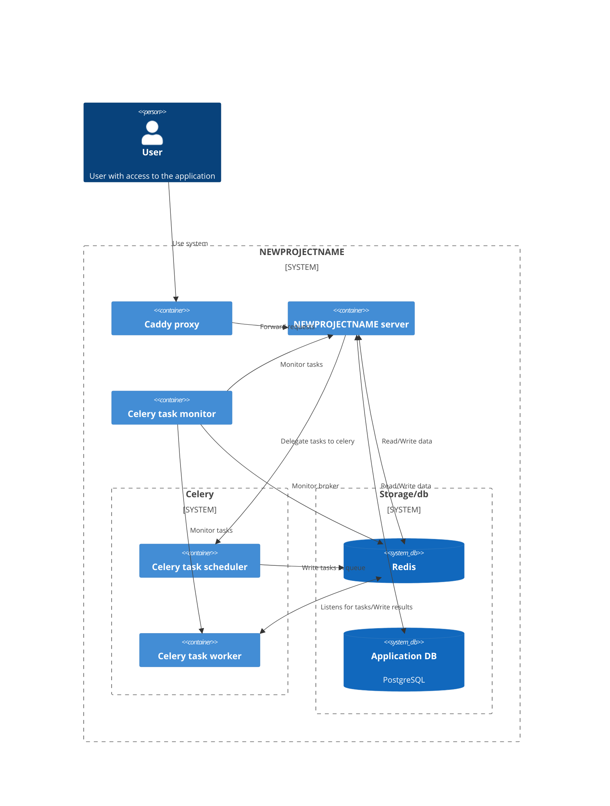

# NEWPROJECTNAME

Insert project description here.

## Containers

```mermaid
C4Context
Person(user, User, "User with access to the application")
System_Boundary(proj, "NEWPROJECTNAME") {
    Container(proj_proxy, "Caddy proxy")
    Rel(user, proj_proxy, "Use system")
    Rel(proj_proxy, proj_be, "Forward requests")
    Container(proj_be, "NEWPROJECTNAME server")
        BiRel(proj_be, app_db, "Read/Write data")
        BiRel(proj_be, redis, "Read/Write data")
    Container(flower, "Celery task monitor")
        Rel(flower, proj_be, "Monitor tasks")
        Rel(flower, proj_celery_worker, "Monitor tasks")
        Rel(flower, redis, "Monitor broker")
    System_Boundary(workers, "Celery"){
        Container(proj_celery_beat, "Celery task scheduler")
        Container(proj_celery_worker, "Celery task worker")
        BiRel(proj_celery_worker, redis, "Listens for tasks/Write results")
    }
    System_Boundary(storage, "Storage/db"){
        SystemDb(redis, "Redis")
        SystemDb(app_db, "Application DB", "PostgreSQL")
    }
    Rel_R(proj_be, proj_celery_beat, "Delegate tasks to celery")
    Rel_R(proj_celery_beat, redis, "Write tasks in queue")
}
UpdateLayoutConfig($c4ShapeInRow="3", $c4BoundaryInRow="2")
```

## Technical challenges

Describe the technical challenges here.
